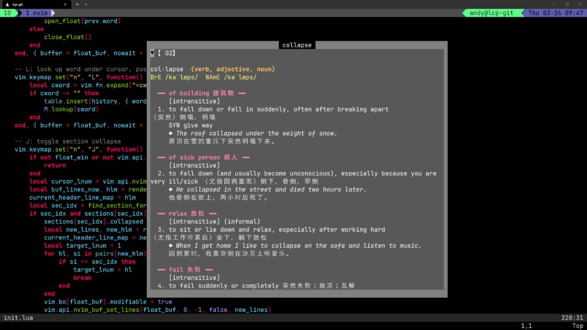

# mdict.nvim

Neovim plugin for looking up words in offline MDict (.mdx) dictionaries. Press a key and get the definition in a floating window -- no browser, no internet required.

Falls back to an online dictionary API when offline lookups fail.



## Features

- **Offline lookup** from `.mdx` dictionary files (MDict format)
- **Multiple dictionaries** -- configure as many `.mdx` files as you want; results from all are shown
- **Online fallback** via [Free Dictionary API](https://dictionaryapi.dev) when no offline match is found
- **Case-insensitive** matching
- **Inflection stemming** -- looks up "running", "churches", "stopped", etc. by stripping suffixes
- **Floating window** with formatted output (pronunciation, definitions, examples, sections)
- **Navigate definitions** -- press `L` on any word in the result to look it up
- **History** -- press `Esc` to go back to the previous lookup
- **Collapsible sections** -- press `J` to toggle a dictionary's results

## Requirements

- Neovim >= 0.9
- Python 3.9+
- [`mdict-mquery`](https://pypi.org/project/mdict-mquery/) Python package

```bash
pip install mdict-mquery
```

## Installation

### lazy.nvim

```lua
{
    "andy12241025/mdict.nvim",
    config = function()
        require("mdict").setup({
            mdx_path = "/path/to/dictionary.mdx",
            -- or multiple:
            -- mdx_path = { "/path/to/dict1.mdx", "/path/to/dict2.mdx" },
        })
        vim.keymap.set("n", "L", function() require("mdict").lookup() end, { desc = "Dictionary lookup" })
    end,
},
```

## Configuration

```lua
require("mdict").setup({
    mdx_path = "",          -- string or list of paths to .mdx files
    python_cmd = "python3",  -- Python executable
    max_width = 80,          -- max floating window width
    max_height = 30,         -- max floating window height
})
```

## Keybindings

In normal mode (configurable):

| Key | Action |
|-----|--------|
| `L` | Look up word under cursor |

Inside the floating window:

| Key | Action |
|-----|--------|
| `L` | Look up word under cursor (drill into definitions) |
| `Esc` | Go back to previous lookup, or close if no history |
| `q` | Close the window |
| `J` | Toggle collapse/expand of current dictionary section |
| `j`/`k` | Scroll up/down |
| `Ctrl-d`/`Ctrl-u` | Page down/up |

## How It Works

1. Pressing `L` grabs the word under the cursor
2. Each configured `.mdx` file is queried via a Python helper using `mdict-mquery`
3. If no offline dictionary has the word, inflected forms are tried (e.g. "plugins" -> "plugin")
4. If still not found, the [Free Dictionary API](https://dictionaryapi.dev) is queried as a last resort
5. Results are displayed in a centered floating window with formatted output

## Support

If you find this plugin useful, you can buy me a coffee:

[](https://ko-fi.com/andy622807)

## License

MIT
